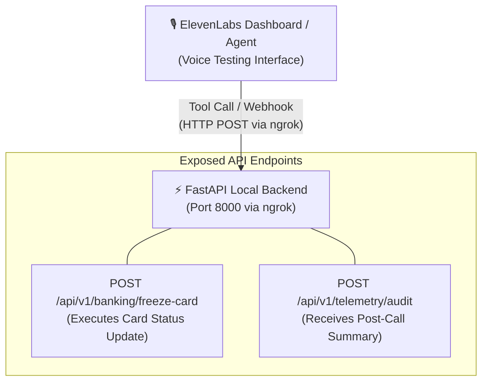

# 🏦 Emergency Banking Voice AI Agent

A real-time Conversational Voice AI Agent designed to execute urgent banking operations such as freezing lost or stolen debit/credit cards via natural voice interactions. 

Built with **FastAPI (Python)**, **ElevenLabs Conversational AI**, and **ngrok**.

---

## 🏗️ Architecture Overview




## ✨ Key Features

- **Real-Time Voice Interface:** Low-latency audio streaming via ElevenLabs WebSockets using `@elevenlabs/client`.
- **Direct Web Socket Integration:** Direct client-side agent session initialization via Agent ID.
- **Dynamic Tool Calling:** The AI automatically invokes external REST endpoints (`/api/v1/banking/freeze-card`) exposed via ngrok based on customer intent.
- **Mock Banking Backend:** State management for account validation and card freezing operations.

---

## 🛠 Tech Stack

- **Backend:** FastAPI (Python), Uvicorn, HTTPX, Pydantic
- **Frontend:** Vanilla HTML5, JavaScript (ES6+), `@elevenlabs/client` SDK
- **Voice AI Platform:** ElevenLabs Conversational AI
- **Tunneling:** ngrok

---

## 📁 Repository Structure

```text

emergency-banking-voice-agent/
├── AGENTS.md            # Agent system context and design guidelines
├── CLAUDE.md            # LLM assistant environment configuration
├── README.md            # Primary repository documentation
├── fastapi/             # Vendored FastAPI package directory
├── httpx/               # Vendored HTTPX client library
├── install/             # Installation and setup scripts
├── pydantic/            # Vendored Pydantic validation library
├── uvicorn/             # Vendored Uvicorn server library
├── venv/                # Primary Python virtual environment
├── venvsource/          # Secondary/Backup virtual environment source
└── voice-agent/         # Active Python backend application
    └── main.py          # FastAPI application (Tools & HMAC Webhooks)
```
## 🚀 Quickstart

### Prerequisites

- Python 3.10+
- An [ElevenLabs API Key](https://elevenlabs.io/) & Agent ID
- [ngrok](https://ngrok.com/) installed


## 🚀 Quickstart

### Prerequisites

- Python 3.10+
- [ngrok](https://ngrok.com/) installed


## 1. Backend Setup
### Clone the repository
```
Bash

git clone [https://github.com/YOUR_USERNAME/emergency-banking-voice-agent.git](https://github.com/YOUR_USERNAME/emergency-banking-voice-agent.git)
cd emergency-banking-voice-agent
```
### Create and activate virtual environment
```
Bash

python3 -m venv .venv
source .venv/bin/activate
python -m pip install --upgrade pip
```
### Install dependencies
```
Bash

pip install fastapi uvicorn httpx pydantic
```  
### Launch FastAPI server on port 8000
```
Bash

uvicorn voice-agent.main:app --reload --port 8000
```
Once launched, open your browser and navigate to: Interactive API Documentation: http://localhost:8000/docs. You should see your /api/v1/banking/freeze-card endpoint listed and ready for testing!

## 2. Expose Local Server via ngrok
- In a new terminal window, expose port 8000 to receive webhook tool calls: 
```
Bash

ngrok http 8000
```
## 3. Test via ElevenLabs Dashboard
- Open your agent in the ElevenLabs Dashboard.

- Go to Tools and add a custom Webhook tool pointing to your ngrok URL:
```
POST https://<your-ngrok-id>.ngrok-free.dev/api/v1/banking/freeze-card
```
- Click Test Agent directly inside the Dashboard, grant microphone access, and start speaking: "I lost my card and need to freeze account acc_9921 immediately."

- Verify the agent executes the tool and confirms account acc_9921 belonging to Alex Chen has been frozen. Check your FastAPI terminal for the incoming 200 OK POST log.

